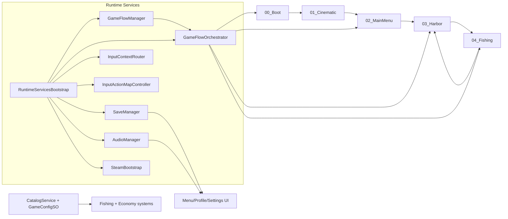

# Architecture Overview

## Runtime Notes
- `RuntimeServicesBootstrap` creates persistent services before scene load.
- `RuntimeServiceRegistry` provides explicit runtime dependency wiring and replaces scene-search based lookups.
- `GameFlowManager` owns flow state and pause transitions.
- `GameFlowOrchestrator` maps states to scenes and input contexts.
- Input is context-driven through action maps (`UI`, `Harbor`, `Fishing`).
- Input rebinding overrides are persisted via `InputRebindingService`.
- Save and audio services are global and survive scene changes.
- UI update pathways prefer event-driven refresh (`SaveDataChanged`, flow state events) over always-on polling for menu/profile/HUD data.
- Fishing combat uses data-driven bite/fight parameters with `FishEncounterModel`.
- Catch history is persisted in `SaveDataV1.catchLog` and surfaced in profile UI.

## Data/Content Notes
- Fish/ship/hook definitions are ScriptableObject-driven.
- `ContentValidator` enforces ID/range/reference rules pre-merge and in CI.
- Content drops should require no code when extending only data assets.
