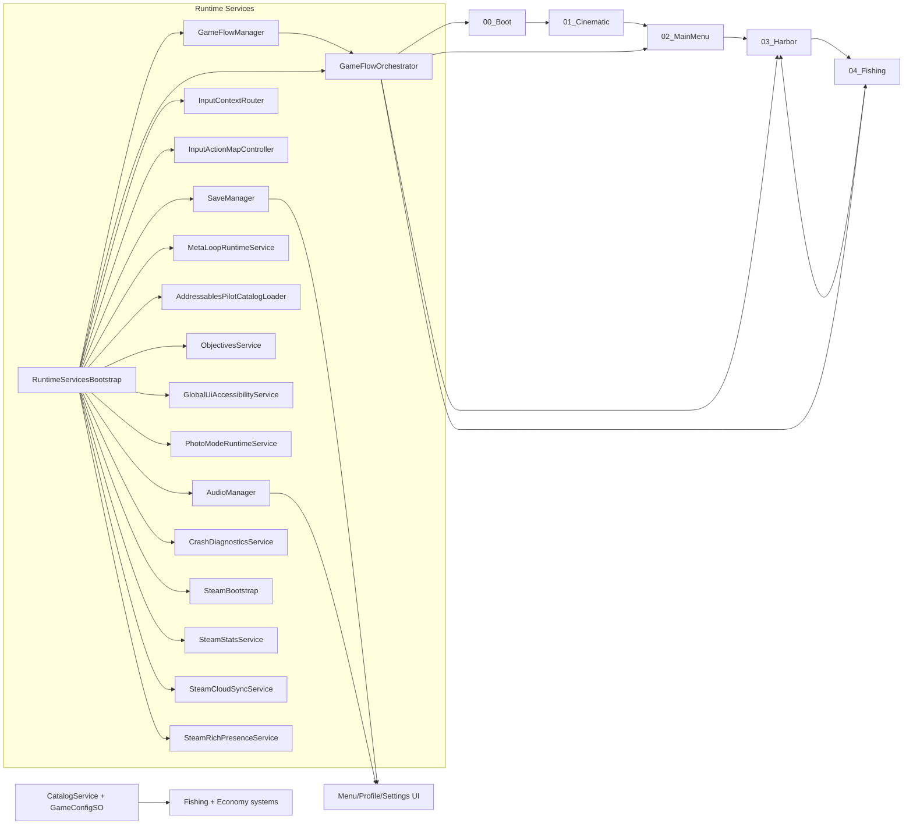

# Architecture Overview

```mermaid
flowchart LR
  Boot[00_Boot] --> Cinematic[01_Cinematic]
  Cinematic --> MainMenu[02_MainMenu]
  MainMenu --> Harbor[03_Harbor]
  Harbor --> Fishing[04_Fishing]
  Fishing --> Harbor

  subgraph Runtime Services
    GS[RuntimeServicesBootstrap]
    GFM[GameFlowManager]
    GFO[GameFlowOrchestrator]
    ICR[InputContextRouter]
    IAMC[InputActionMapController]
    SM[SaveManager]
    MLS[MetaLoopRuntimeService]
    APL[AddressablesPilotCatalogLoader]
    OBJ[ObjectivesService]
    UAS[GlobalUiAccessibilityService]
    PMS[PhotoModeRuntimeService]
    AM[AudioManager]
    CR[CrashDiagnosticsService]
    ST[SteamBootstrap]
    SS[SteamStatsService]
    SC[SteamCloudSyncService]
    SR[SteamRichPresenceService]
  end

  GS --> GFM
  GS --> GFO
  GS --> ICR
  GS --> IAMC
  GS --> SM
  GS --> MLS
  GS --> APL
  GS --> OBJ
  GS --> UAS
  GS --> PMS
  GS --> AM
  GS --> CR
  GS --> ST
  GS --> SS
  GS --> SC
  GS --> SR

  GFM --> GFO
  GFO --> Boot
  GFO --> MainMenu
  GFO --> Harbor
  GFO --> Fishing

  Catalog[CatalogService + GameConfigSO] --> FishingSystems[Fishing + Economy systems]
  SM --> UISystems[Menu/Profile/Settings UI]
  AM --> UISystems
```

## Runtime Notes
- `RuntimeServicesBootstrap` creates persistent services before scene load.
- `RuntimeServiceRegistry` provides explicit runtime dependency wiring and replaces scene-search based lookups.
- `BootstrapAssetContractValidator` defines required launch assets (`InputActions_Gameplay`, `Config/SO_GameConfig`, `Config/SO_TuningConfig`, `Pilot/Tutorial/SO_TutorialSpriteLibrary`) and emits structured startup diagnostics for missing contracts.
- Missing required bootstrap assets now trigger fail-fast startup behavior in release profile runtime (`RAVEN_BUILD_PROFILE_RELEASE`), while non-release contexts keep explicit error diagnostics for remediation.
- Scene runtime composition is module-based (`Boot`, `Cinematic`, `MainMenu`, `Harbor`, `Fishing`) behind a shared composer seam in `SceneRuntimeCompositionBootstrap`.
- Scene object wiring is driven by explicit scene contracts (`CinematicSceneContract`, `HarborSceneContract`, `FishingSceneContract`), with temporary name-fallback resolution and warning logs during migration.
- Scene modules consume runtime dependencies through a composition service resolver seam instead of ad hoc `RuntimeServiceRegistry.Get<T>()` calls.
- `GameFlowManager` owns flow state and pause transitions.
- `GameFlowOrchestrator` maps states to scenes and input contexts.
- Intro replay return routing keeps `MainMenuSettings` and `MainMenuProfile` follow-up intents distinct, and clears follow-up panel flags for default MainMenu exits.
- Main-menu follow-up panel opens use typed seam `IMainMenuNavigator` (registered through `RuntimeServiceRegistry`) instead of string `SendMessage` dispatch.
- Input is context-driven through action maps (`UI`, `Harbor`, `Fishing`).
- Input rebinding overrides are persisted via `InputRebindingService`.
- Save and audio services are global and survive scene changes.
- Save runtime is decomposed into bounded collaborators under `Assets/Scripts/Save/`: `AtomicJsonSavePersistenceAdapter` (`ISavePersistenceAdapter`), `SaveMigrationLoadCoordinator` (`ISaveMigrationLoadCoordinator`), `SaveProgressionService`, and `SaveDomainMutationService`.
- `SaveManager` remains the Unity-facing orchestration facade (lifecycle/events/throttle wiring), while persistence/migration/progression/tutorial-profile mutation rules execute through extracted save-domain services.
- Meta-loop runtime service adds contracts, collections, demand modifiers, and gear synergies for retention depth.
- Addressables pilot loader can asynchronously provide phase-one fish catalog overlays with resource fallback.
- Objectives service tracks non-Steam gameplay goals and persists objective progress/rewards.
- Global UI accessibility service applies persisted UI scaling at runtime.
- Photo mode runtime service auto-binds screenshot controls to main camera.
- Crash diagnostics writes local-only artifact files for exception/error logs.
- UI update pathways prefer event-driven refresh (`SaveDataChanged`, flow state events) over always-on polling for menu/profile/HUD data.
- Interface-first seam example: `HudOverlayController` can be explicitly wired with `ISaveDataView` (`ConfigureDependencies`) for tests/mocks, and falls back to `RuntimeServiceRegistry` only when dependency injection is not provided.
- `FishingLoopTutorialController` now uses explicit `DependencyBundle` wiring from scene composition and one-time lifecycle initialization, removing per-frame dependency/subscription discovery.
- `CatchResolver` now initializes dependencies once and keeps frame-loop responsibilities focused on encounter/catch resolution; optional camera/tutorial/environment/condition setup is applied during composition/lifecycle initialization instead of per-frame checks.
- Harbor interaction flow is decomposed into bounded components: `HarborMenuStateRouter` (menu/panel state), transaction handlers (`HarborShopTransactionHandler`, `HarborFisheryTransactionHandler`, `HarborShipyardTransactionHandler`), and view presenters (`HarborShopViewPresenter`, `HarborFisheryCardViewPresenter`, `HarborInteractionViewPresenter`).
- `HarborSceneInteractionRouter` now accepts typed dependency bundles (`Runtime`, `Menu`, `Text`, `Buttons`) for composition-time wiring, with the legacy wide `Configure(...)` retained as a compatibility shim.
- Fishing combat uses data-driven bite/fight parameters with `FishEncounterModel`.
- Fishing conditions (time/weather) apply modifier layers to fish spawn/fight behavior.
- Catch history is persisted in `SaveDataV1.catchLog` and surfaced in profile UI.
- Progression state (`XP`, `level`, unlock stubs) is persisted in `SaveDataV1.progression`.
- Steam stats/achievements mirror local save stats, Steam Cloud sync follows newest-wins policy, and optional Rich Presence tracks flow state.

## Data/Content Notes
- Fish/ship/hook definitions are ScriptableObject-driven.
- Catalog runtime merge order: base `GameConfigSO` -> phase-one addressables fish overlay.
- `ContentValidator` enforces ID/range/reference rules pre-merge and in CI.
- Content drops should require no code when extending only data assets.
